# Membuat Server Public dan Private

1. Pertama pilih Launch a Virtul Machine EC2

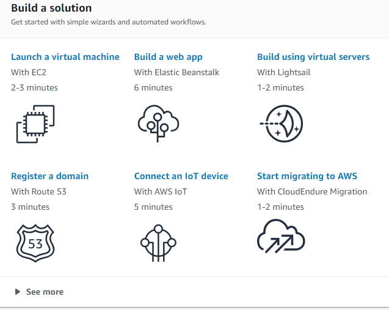

2. Pilih OS Ubuntu Server 18.04 LTS 64-bit

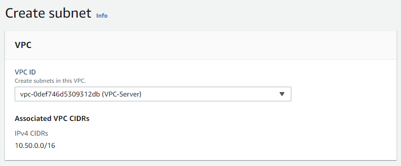

3. Gunakan type machine t2-micro

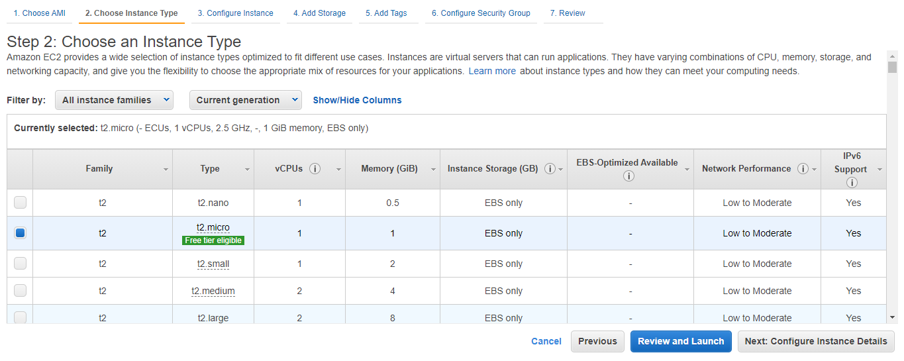

4. Pada step ini disable Auto-assign Public IP

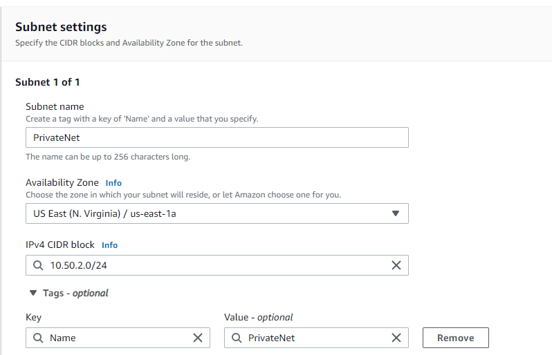

6. edit storage sesuikan kebutuhan, defultnya adalah 8GB

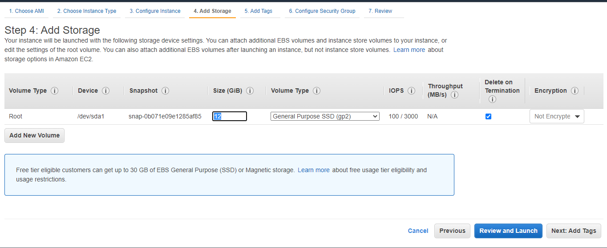

7. Beri nama security group (optional), buka port seperti gambar berikut :
    * 22 : port untuk akses SSH
    * 80 : port untuk akses HTTP
    * 443 : port untuk akses HTTPS

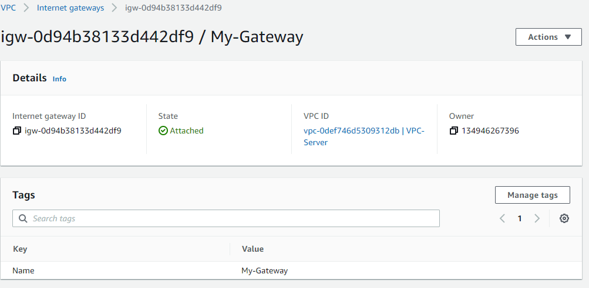

8. kemudian buat keypair untuk mengakses server menggunakan SSH, beri nama dan download keypair, kemudian launch instances untuk membuat.

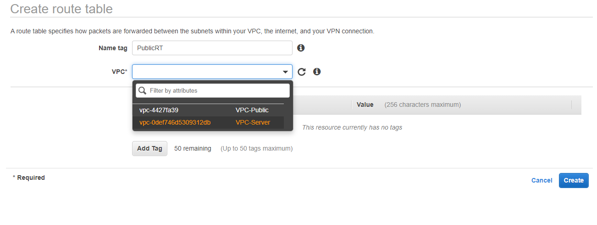

9. Masuk ke menu Sidebar Network and Security kemudian pilih menu Elastics IP, lau klik Allocate

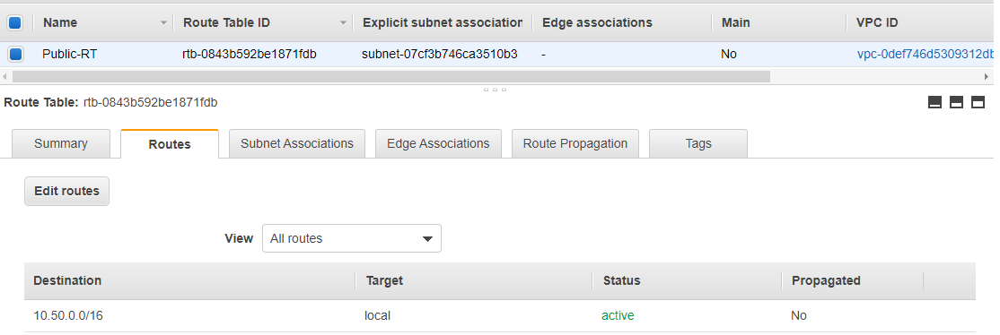

10. Pilih Elastic IP yaang sudah dialokasikan, pada menu action pilih Associates Elastic IP Address.

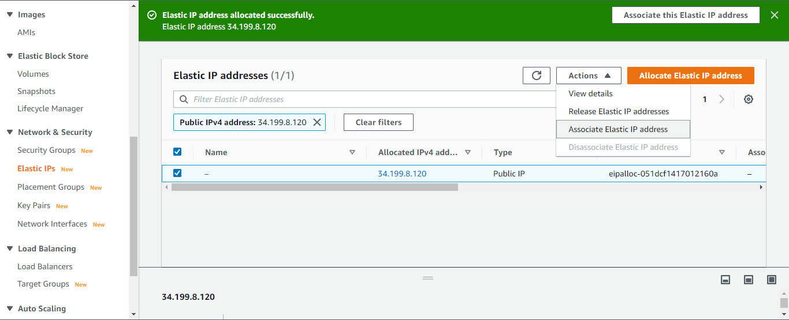

11. Kemudian cari instances yang sudah kita buat sebelumnya, setelah klik Associate

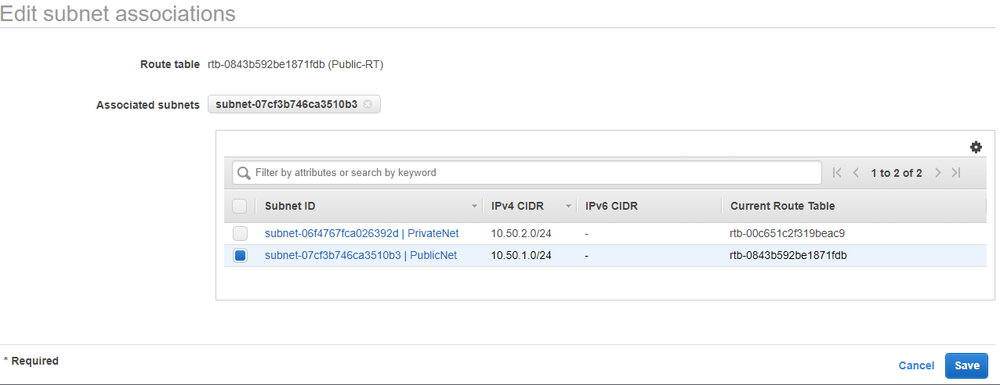

# Create Private Server

12. Untuk proses tahapan pembuatan server sama seperti diatas bedanya disini pada bagian tidak ada yg perlu dirubah kecuali bagian security yang harus menerima semua traffic, setting seperti berikut :
* Rubah Type menjadi All Traffic artinya server akan menerima traffic dari port 0-65535
* Source rubah menjadi My IP yaitu menggunakan ip kita untuk melakukan remote nantinya (untuk sementara).kemudian launch instances

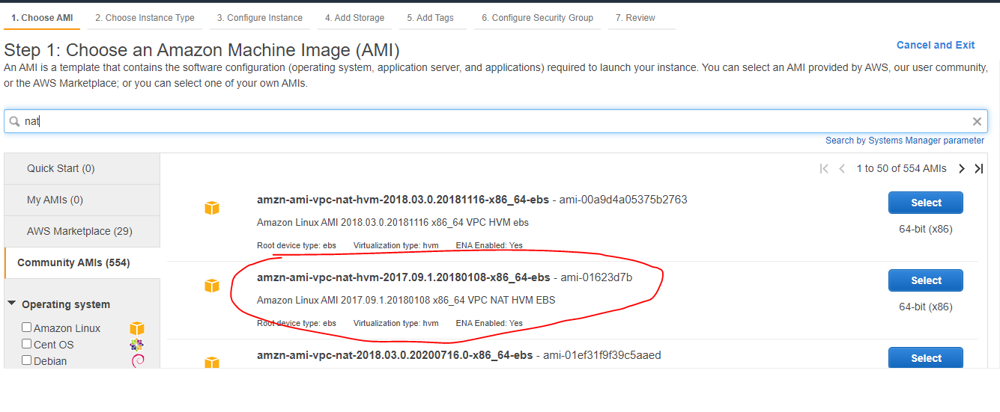

# Akses Semua Server dengan SSH

13. akses server dengan perintah ssh -i keypair-kit username@ip-public.
kemudian tambahkan user baru dengan command adduser anwar dengan detail seperti pada gambar, dan tambahkan user ke grup dengan command usermod -aG sudo anwar

14. kemudian ubah config sshd agar setiap login hanya perlu mengisikan password buat dengan keypair lagi
* ubah autentikasi menjadi PasswordAuthentication yes

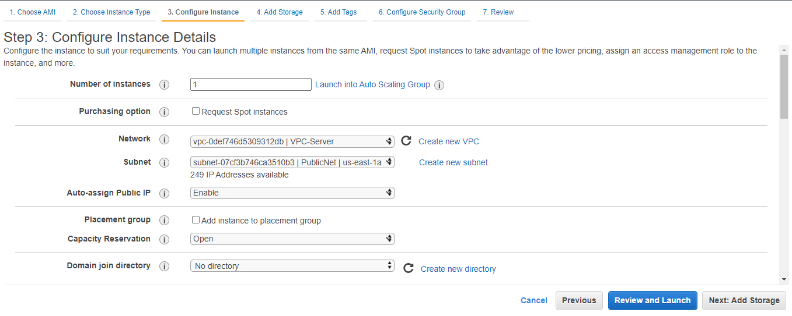

15. restart services ssh dengan perintah systemctl restart sshd kemudian keluar dan coba login kembali dengan user yang sudah dibuat ssh anwar@ip-public

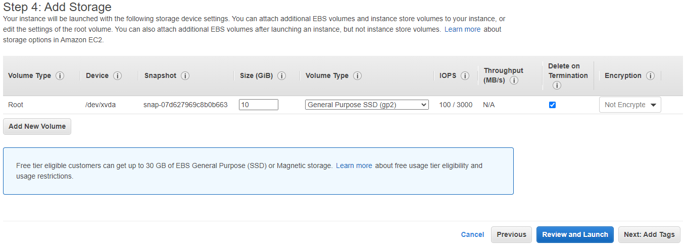
