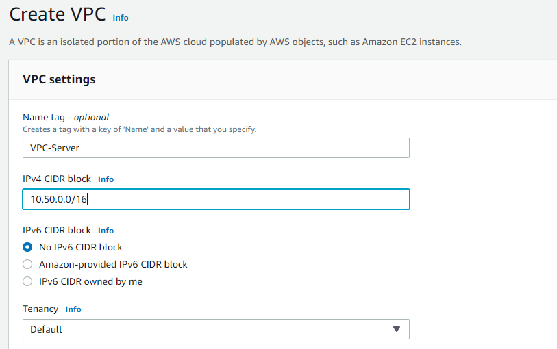
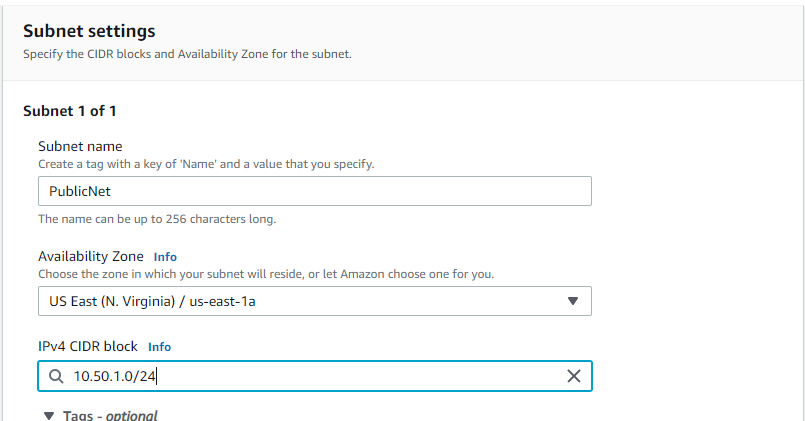
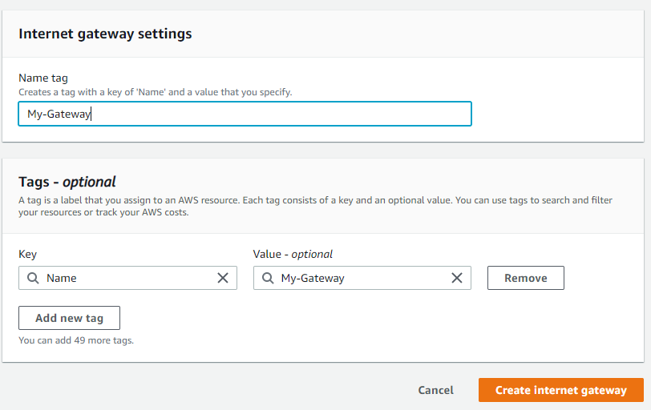
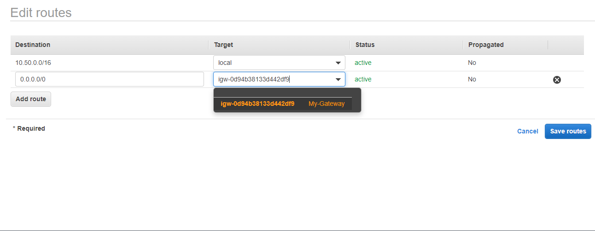
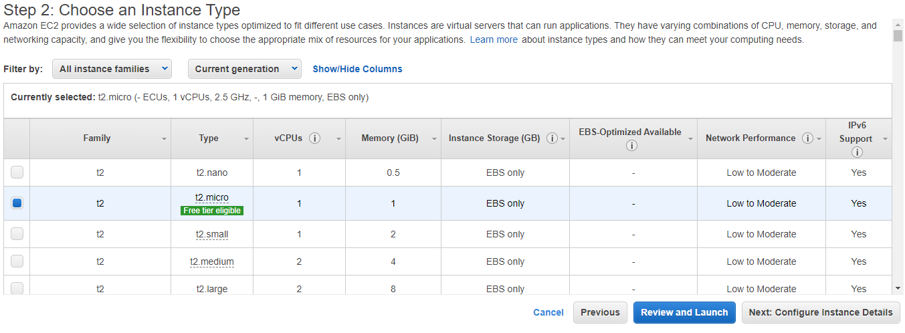
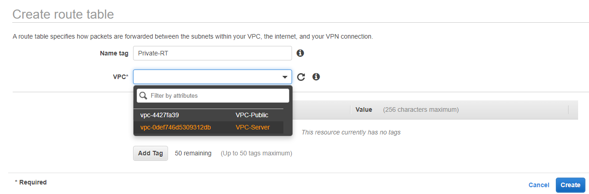
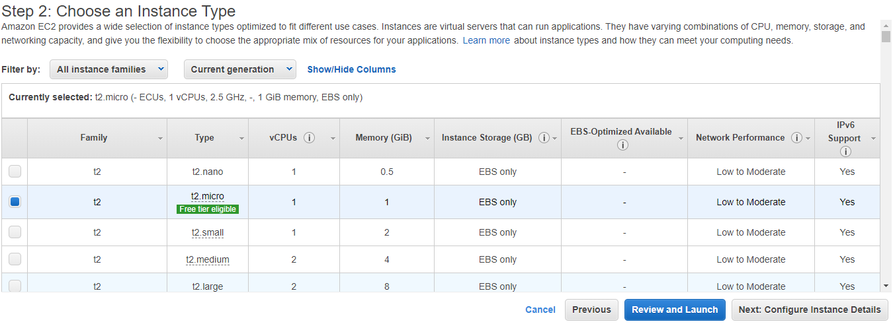
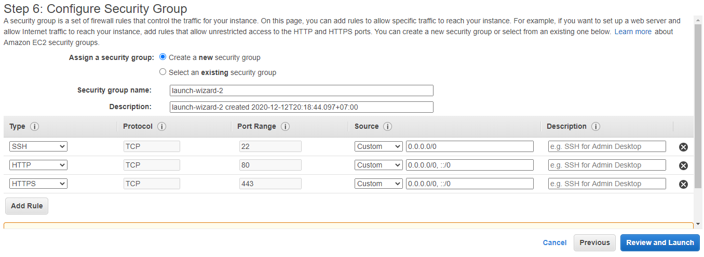

# Create and Setup Server

1. Pertama Buatlah Sebuah VPC berinama VPC, disini saya menggunakan dari block 10.50.0.0/16
* IPV4 CIDR block : 10.50.0.0/16

2. kemudian kita buat subnet Subnet Public dan Private, berikut detail ip untuk Public dan Private Subnet.
* PublicNet : 10.50.1.0/24
* PrivateNet : 10.50.2.0/24

3. Buat Internet Gateway dan berinama dan kemudian Attach atau hubungkan pada VPC yang sudah kita buat sebelumnya.

4. Buat Route Tables untuk Public Route, hubungkan ke VPC tadi

* pada tab Route klik edit Routes

* tambahkan destination 0.0.0.0/0 dan Targetnya adalah Internet Gateway yang sudah kita buat sebelumnya.

* kemudian pada tab association edit dan asosiasikan dengan PublicNet

6. Buat NAT Instances baru Pilih pilih AMI Community pilih image seperti gambar

7. kemudian pada step ini sesuaikan seperti berikut:
* Network : Gunakan VPC-Server yang sudah dibuat sebelumnya
* Subnet : Gunakan Public Subnet
* Auto-Assign Public IP : enable

* pada bagian Security Group gunakan all Traffic dan source rubah menjadi ip network Private server.

8. Kemudian Disable Source/Dstination NAT Instances agar private server dapat terhubung ke internet

9. Kemudian buat route table untuk private Network

* Edit Route tambahkan destination 0.0.0.0/0 dan source menjadi NAT Instances yang sudah kita buat.

* Terakhir assosiasikan pada PrivateNet

# Buat Public dan Private Server

10. Buat Instances Pilih Ubuntu 18.04

11. kemudian pada step ini sesuaikan seperti berikut:
* Network : Gunakan VPC-Server yang sudah dibuat sebelumnya
* Subnet : Gunakan Public Subnet
* Auto-Assign Public IP : disable

12. Beri nama security group (optional), buka port seperti gambar berikut :
    * 22 : port untuk akses SSH
    * 80 : port untuk akses HTTP
    * 443 : port untuk akses HTTPS

# Private Server

13. Pada Server Private pada step ini sesuaikan seperti berikut:
* Network : Gunakan VPC-Server yang sudah dibuat sebelumnya
* Subnet : Gunakan Private Subnet
* Auto-Assign Public IP : disable

dan konfigursi seperti berikut rubah source menjadi ip network public server :

# Elastic IP Public Server
14. Buat Elastic IP untuk public server agar server bisa diakses di internet dan ip tidak berubah-ubah.

# Remote Server yang sudah Dibuat

15. remote server dengan ssh, kemudian buat user baru pada server public seperti dibawah

* edit config sshd agar ketika login tanpa menggunakan keypair lagi edit di /etc/ssh/sshd_config ubah authentication menjadi yes, setelah restart dan coba login dengan user baru tadi.

# Remote private Server
setelah selesai kita akan simpan keypair private di public server, buat file keypair baru dan paste keypair kita disini, kemudian chmod 0600 untuk keypair dan kemudian coba akses, ulangi seperti langkah diatas buat user baru.

