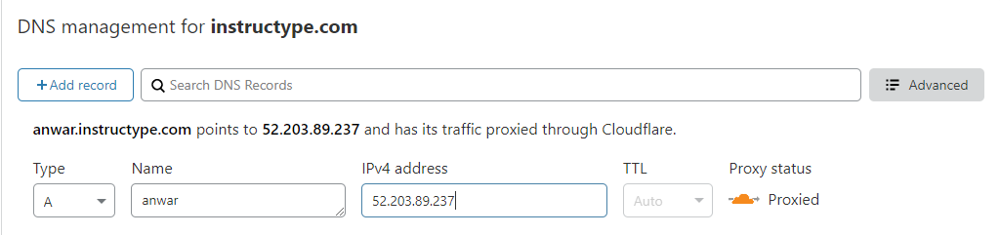
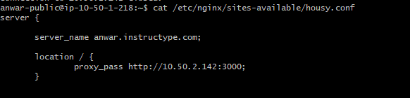
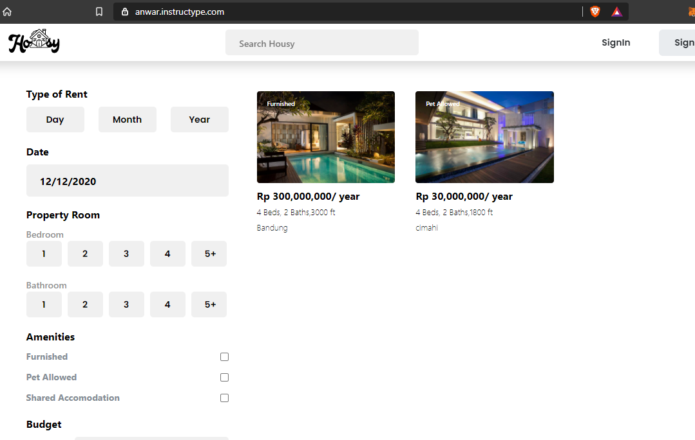

# Custom Domain

1. Buat sebuah subdomain baru pada cloudflare menggunakan ip dari server public agar nantinya di redirect ke sub domain ini.

2. rubah settingan proxy pada housy.conf menjadi nama sub domain kita dan kemudian restart nginx

