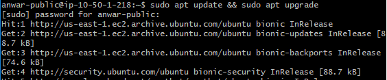
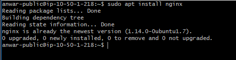
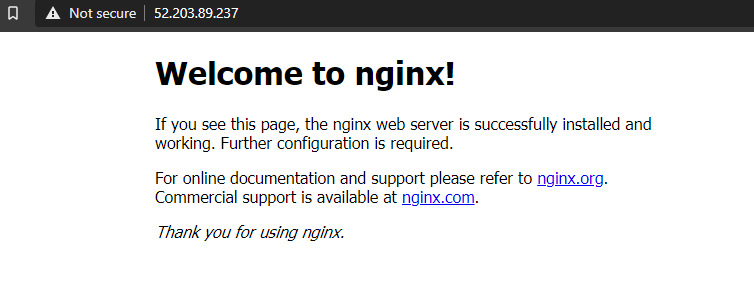
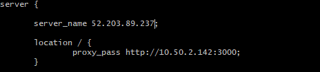

# Reverse Proxy Web Server

1. lakukan update dan upgrade pada server public kita

````
sudo apt update && sudo apt upgrade
````



2. setelah itu install Nginx pada server dengan perintah berikut :

```
 sudo apt install nginx
```




3. buat file baru pada direktori ```/etc/nginx/site-available/``` buat config dengan nama ```housy.conf```



* Setelah itu hubungkan file config kita ke direktori site-enable dan restart nginx dengan cara berikut :

```
ln -s /etc/nginx/site-available/housy.conf /etc/nginx/site-enabled/housy.conf
sudo systemctl restart nginx
```

