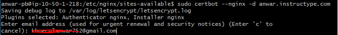
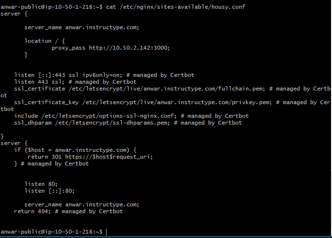

# SSL Configuration

1. tambahkan repository ppa certbot dan install certbot seperti berikut :

```
sudo add-apt-repository ppa:certbot/certbot
sudo apt update
sudo apt install certbot python-certbot-nginx
```

* kemudian jalankan perintah ```sudo certbot -d anwar.instructype.com``` dan ikuti instruksi yang ada dengan pilih berikut



```
email aktif : untuk informasi saat sertifikat akan expire
Agree
Yes
2
```

* cek housy.conf dan lihat ssl sudah terkonfigurasi

``` 
cat etc/nginx/site-available/housy.conf
```



