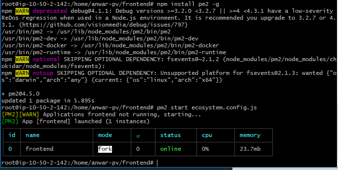

# Server for Application

1. Setelah meremote server private dari public melalui SSH sekarang kita bisa mulai config lakukan update dan upgrade pada sistem.

````
sudo apt update && sudo apt upgrade
````


2. setelah itu install node js pada server dengan perintah berikut :

```
 curl -sL https://deb.nodesource.com/setup_10.x | bash -
 sudo apt install nodejs -y
```

3. Lakukan clone pada repo housy, rename direktori menjadi frontend, masuk ke direktori dan install depedensi

```
git clone https://github.com/DumbwaysDotId/DW15WDTPH_housy
mv DW15WDTPH_housy frontend
npm install
```


4. buat file ```ecosystem.config.js``` pada direktori frontend.


5. Install dan jalankan Aplikasi PM2, jalankan script ecosystem.config.js

```
sudo npm install pm2 -g
pm2 start ecosystem.config.js
```

