# Instalasi Ubuntu Server 18.04 Menggunakan VirtualBox

1. Buat VM Baru dengan Nama khaerul Anwar - DWDS02ISIS dan pilih Ubuntu-64 bit.

2. kemudian Pilih **Create a virtual disk now.**

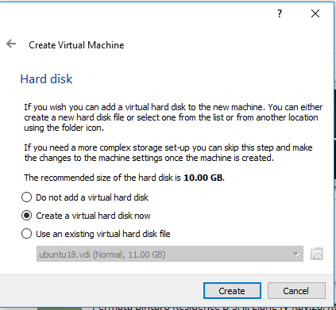

3. pilih - **VDI (Virtual Disk Image)** kemdian Next.

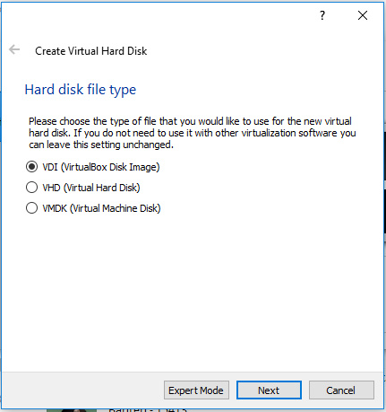

4. pilih - **Dynamically Allocated** kemudian Next.

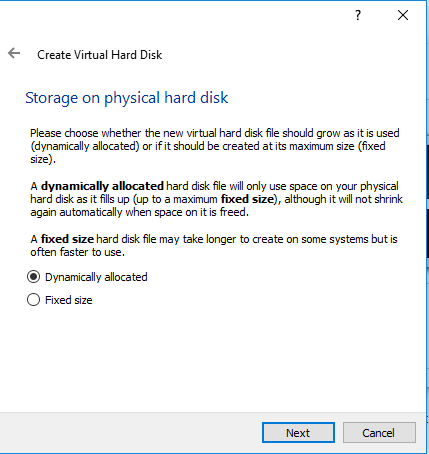

5. Sesuaikan Jumlah kapasitas disk kemudian Create dan Start.

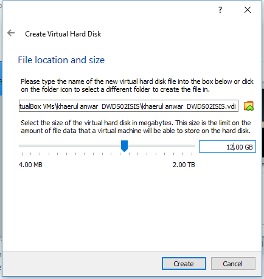

6. Kemudian Tambahkan file Image Ubuntu Server 18.04.

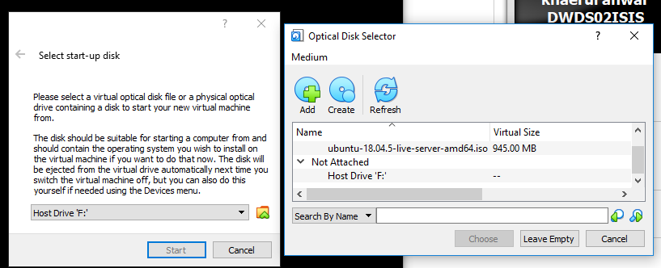

7. Kemudian Jalankan Mesin.

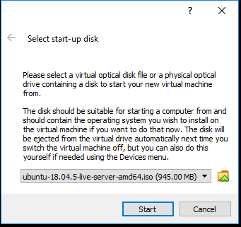

8. Tunggu Sampai Proses selesai.

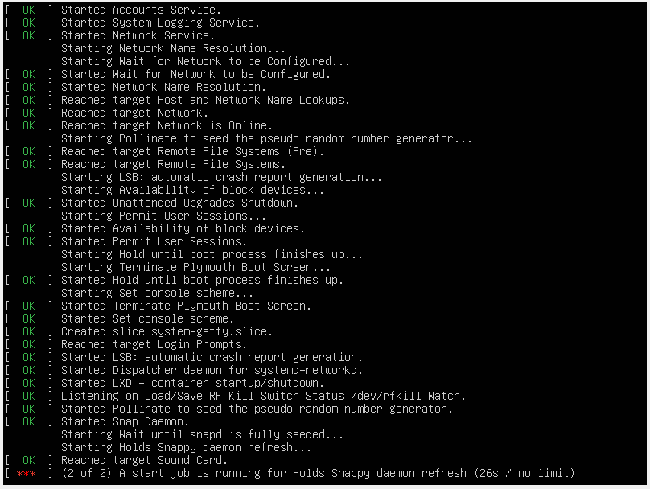

9. Pilih bahasa **English** dan enter.

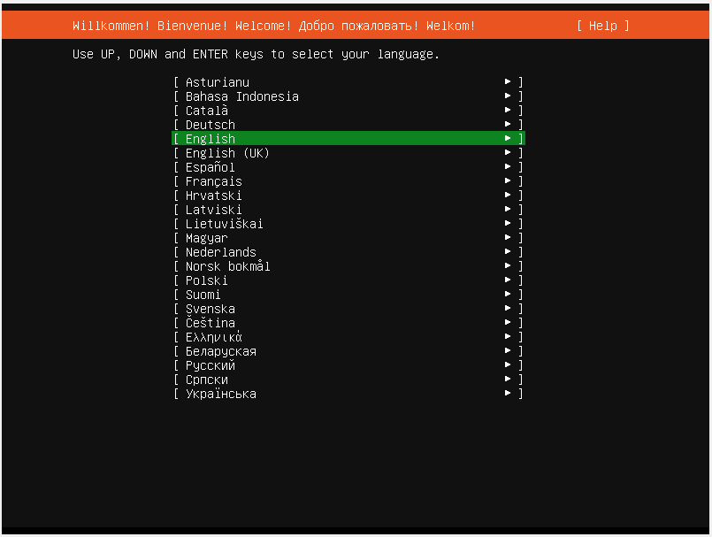

10. Kemudian Pilih **Continue Without Updating.**

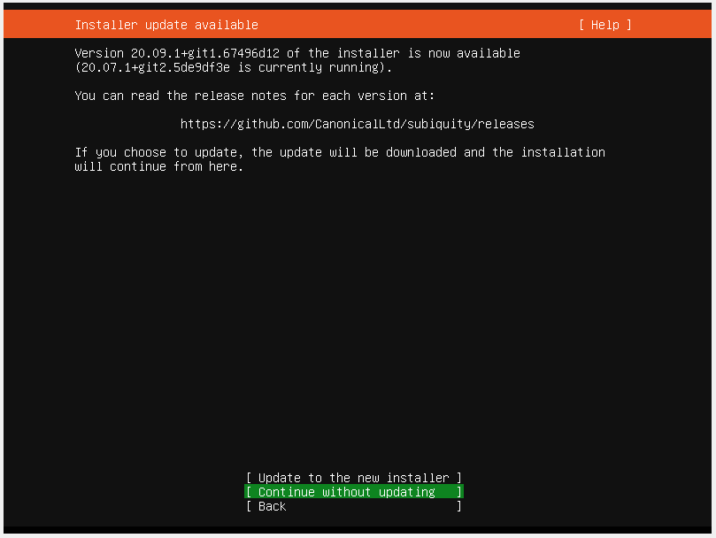

11. Kemudian Keyboard **English US.**

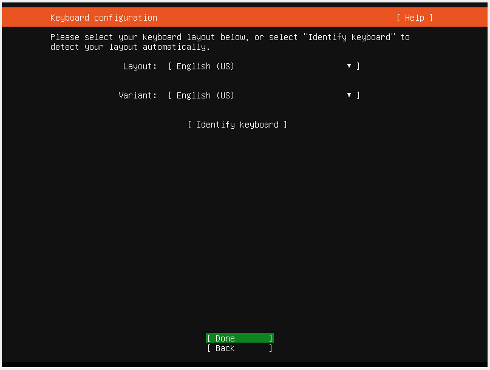

12. Sesuaikan Network Adapter yang digunakan disini saya menggunakan **enp0s3 Ethernet.**

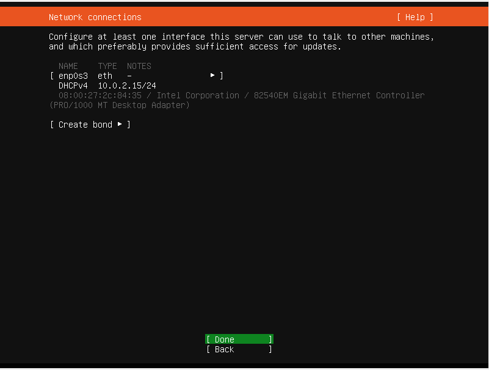

13. Kemudian Pilih **Done.**

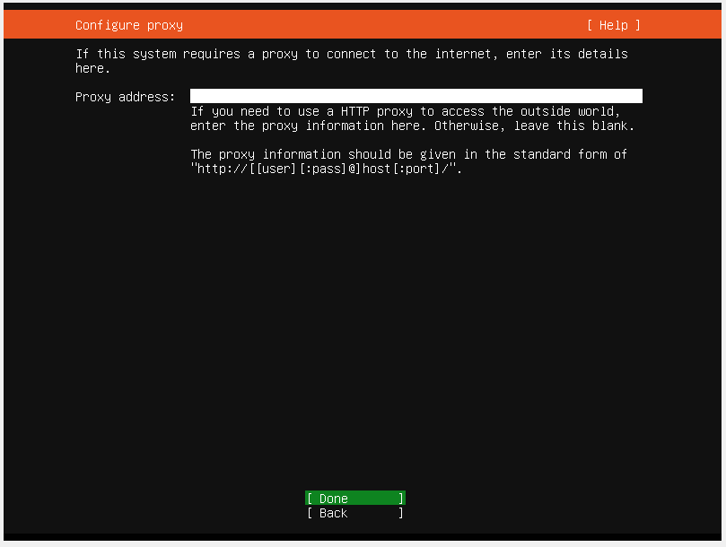

14.  Pilih **Done.**

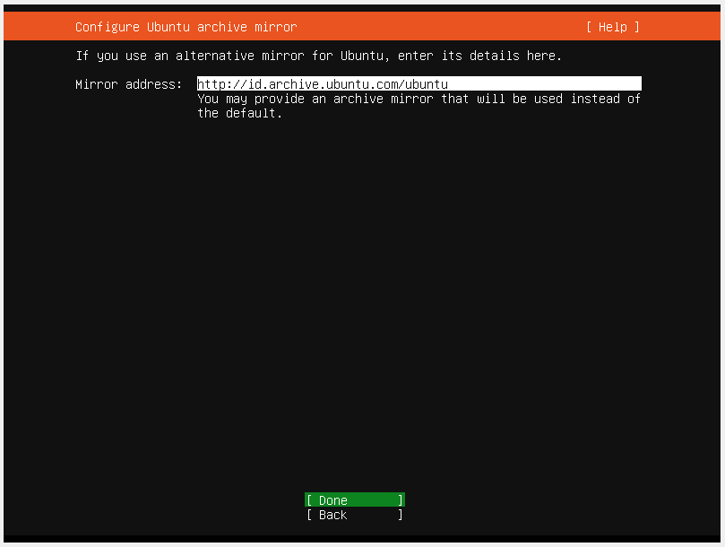

15. Kemudian Pilih **Custom Storage layout.**

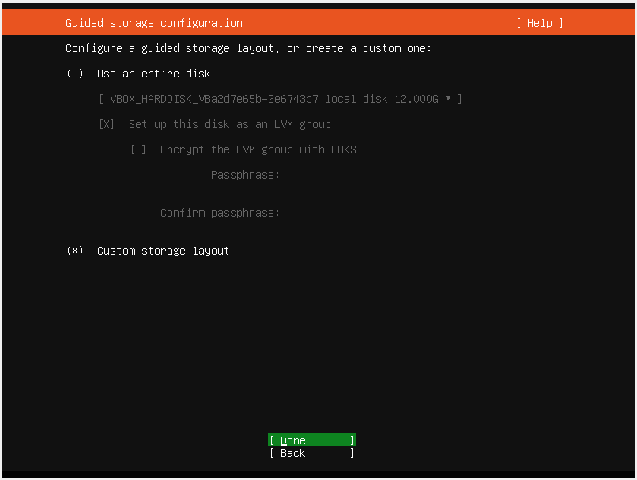

16. buat partisi baru caranya pilih device kemudian **Add GPT Application.**

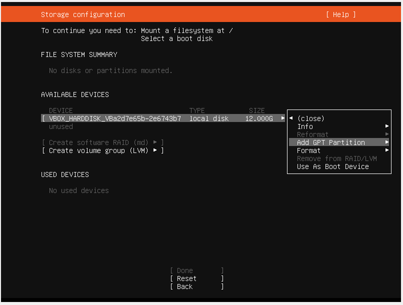

17. Sesuaikan Kebutuhan Partisi Swap disini saya masukan 2 Gigabyte (2G) Kemudian **Create.**

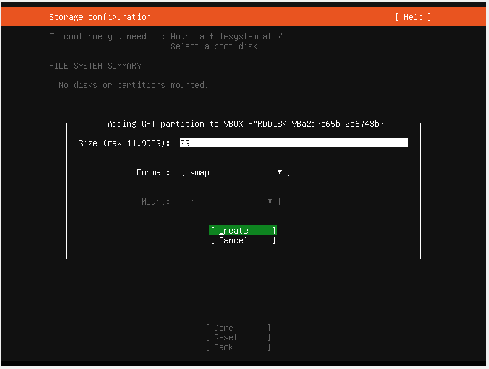

18. buat partisi baru caranya pilih device kemudian **Add GPT Application.**

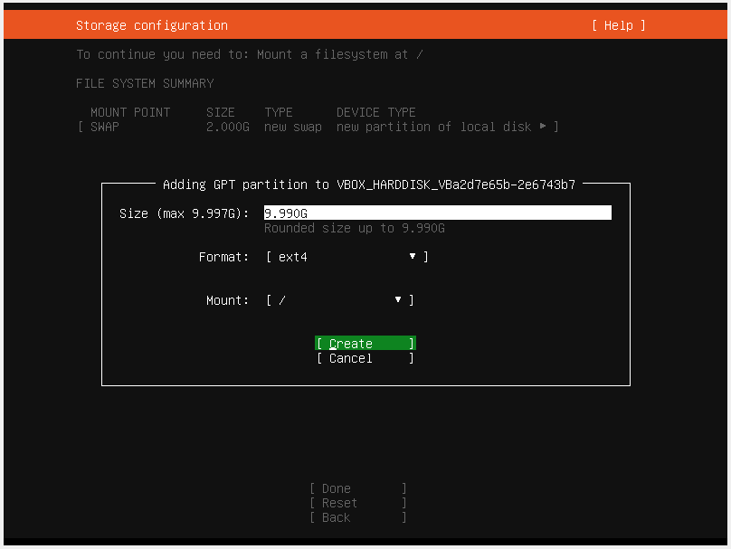

19. Sesuaikan Kebutuhan Partisi root disini saya masukan 10 Gigabyte Kemudian **Create** lalu Done.

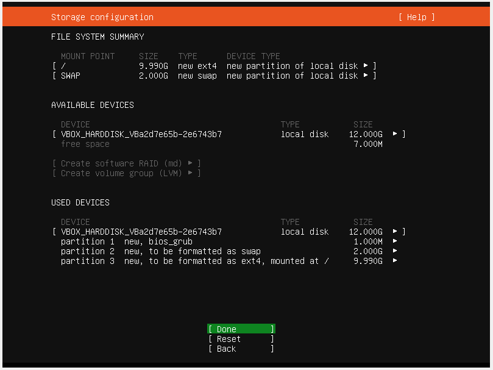

20. Muncul peringatan pilih **Continue**

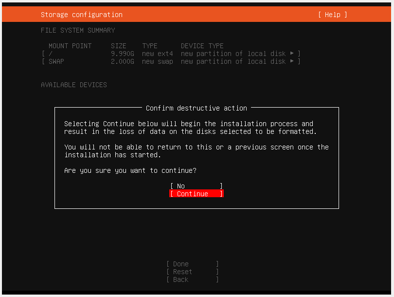

21. input profile sesuai kebutuhan.

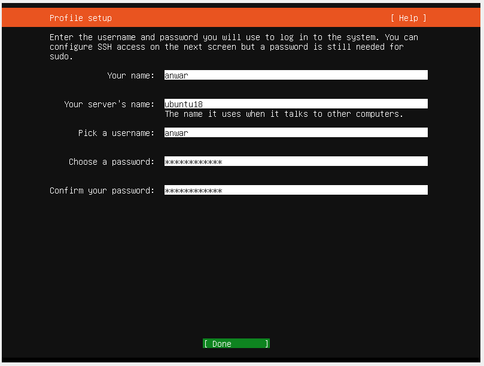

22. Install OpenSSH Server Kemudian **Done**

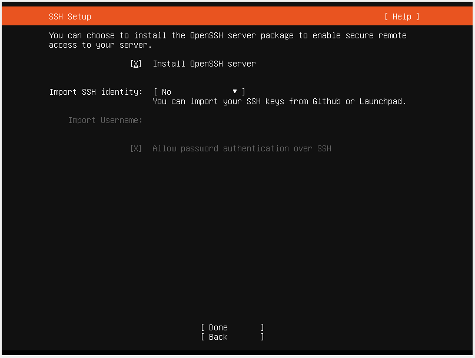

23. Abaikan tambahan aplikasi yang akan diinstall **Done**

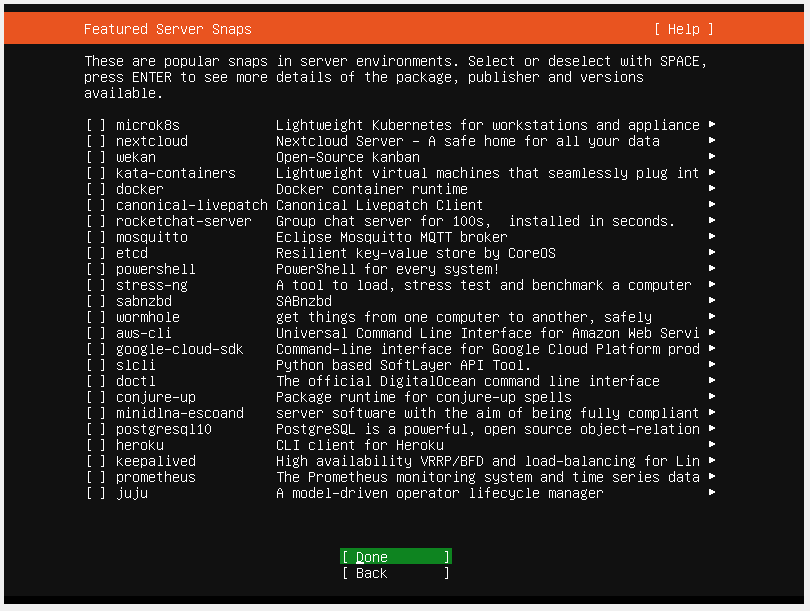

24. Terakhir Tunggu Hingga proses instalasi selesai

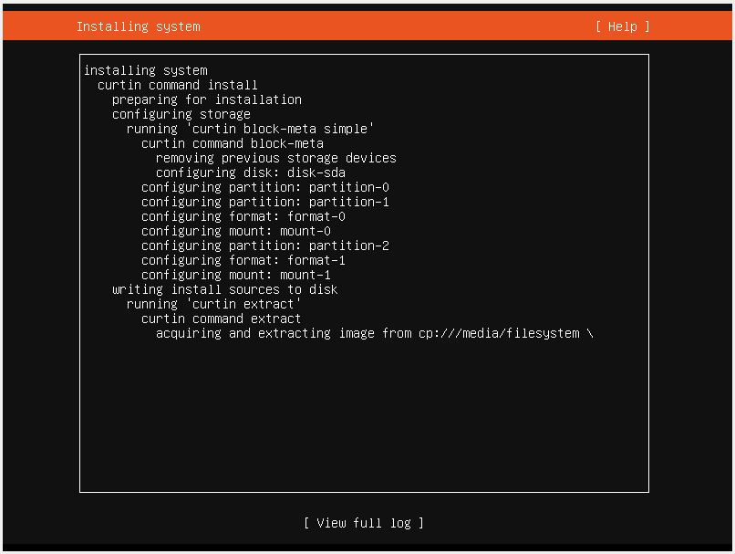