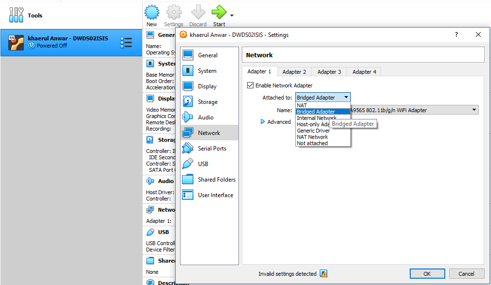

# Konfigurasi Adapter Agar Dapat Terhubung Ke Internet

1. Buka Settings Pada Mesin VirtualBox kita.

2. Masuk Tab **Network** > Pada Adapter 1 Rubah dari **NAT** ke **Bridge Adapter.**

3. Jalankan VM kembali dan rubah settingan ip dari DHCP ke Static dengan menjalan perintah **"sudo vi /etc/netplan/00-installer-config.yaml"** tekan **e** untuk edit, setelah tekan **i** untuk melakukan insert data. edit seprti pada gambar.

4. kemudian restart servicesnya dengan perintah **"sudo netplan apply"** jika semuanya benar akan tampil seperti gambar.

