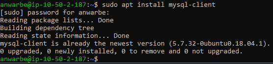
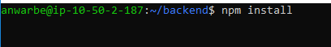
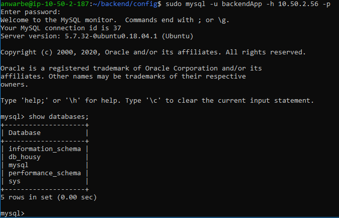

# Setup Deployment Backend Application

* masuk ke server backend, lakukan update dan upgrade dan install mysql client

````
sudo apt update && sudo apt upgrade
sudo apt install mysql-client
````



* Clone repo housy backend rename menjadi housy


* *setelah itu install node js pada server dengan perintah berikut :

```
 curl -sL https://deb.nodesource.com/setup_10.x | bash -
 sudo apt install nodejs -y
```
 * masuk ke direktori backend 

 ```
 npm install
 npm install -g sequelize-cli
 npm install -g pm2
 ```



* lakukan test remote ke server database yang sudah kita config

```
sudo mysql -u username -h ip-server-database -p
```



* kemudian setting config database pada aplikasi backend dengan database dan user yang sudah kita buat

```
sudo vi config/config.json
```


setelah selesai config database production pada config.json, lakukan migrasi database :

```
sequelize-cli db:migrate
```


