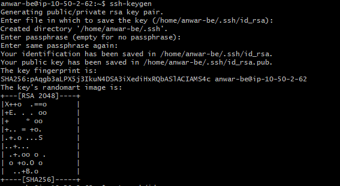
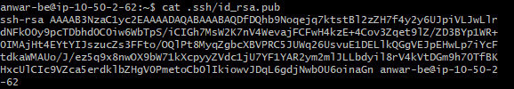
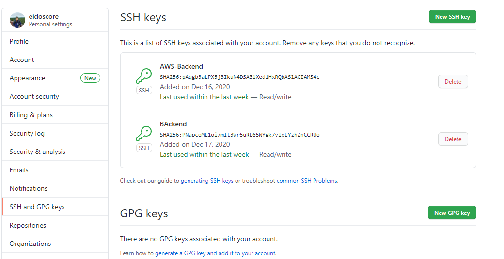
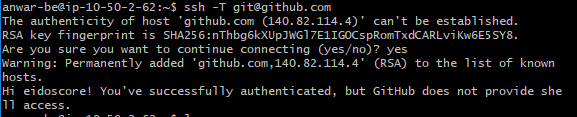
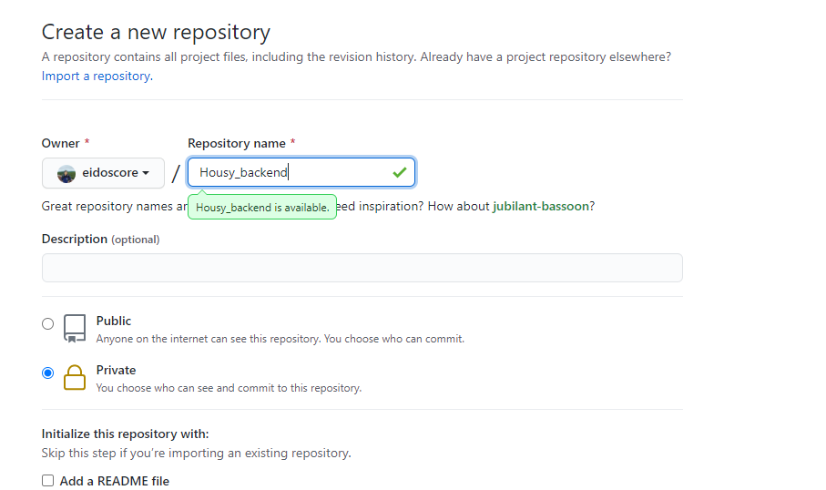
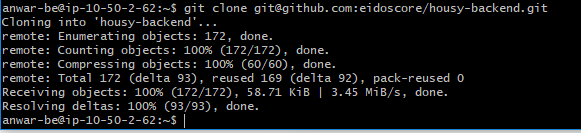
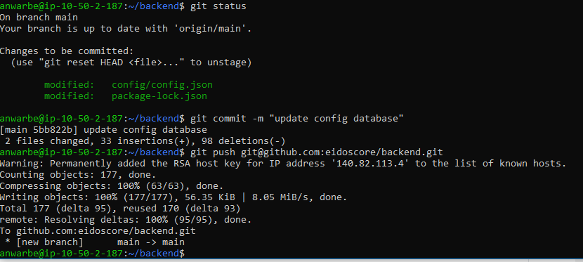
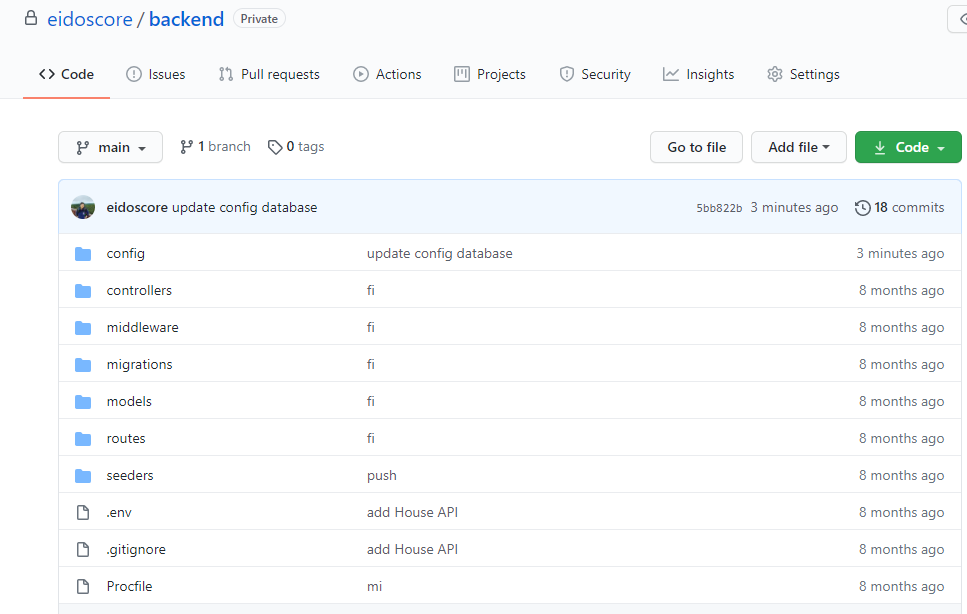

# Setup GIT and SSH

* Pertama fork repository housy front/backend

* kemudian generate ssh key, disini saya praktekan pada server , copy public key dari key yang sudah di generate

* tambahkan public key pad akun kita dan simpan

* kemudian lakukan test koneksi ke akun github kita

* buat repository baru untuk backend dan frontend

* Clone repository backend dan rename 

* lakukan commit perubahan dan push ke repository yang sudah

* cek repository github kita
