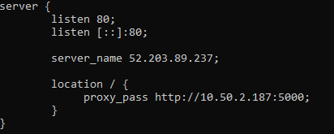

# Reverse Proxy Server

* buat reverse proxy untuk server backed kita pada server public nginx ``/etc/nginx/sites-available`` berinama backend.conf

```
server {
        listen 80;
        listen [::]:80;

        server_name 52.203.89.237;

        location / {
             proxy_pass http://10.50.2.187:5000;
        }
}
```



* Buat load balancing untuk server frontend agar traffic bisa dipecah.

**Note** disini kita harus membuat 1 instances lagi untuk load balance frontend server


* kemudian disini saya menggunakan postman untuk mengambil data pada server 


