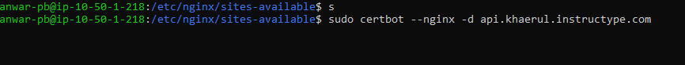
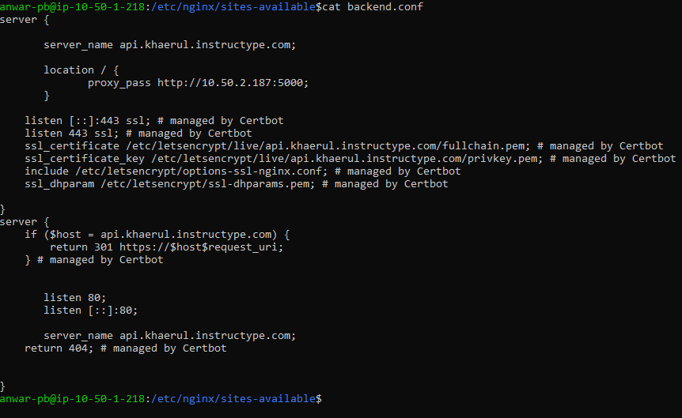
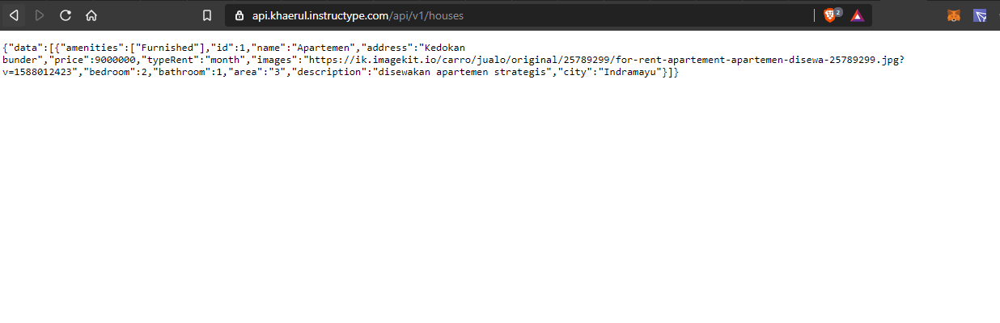
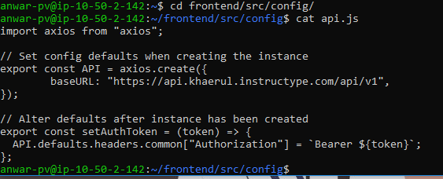
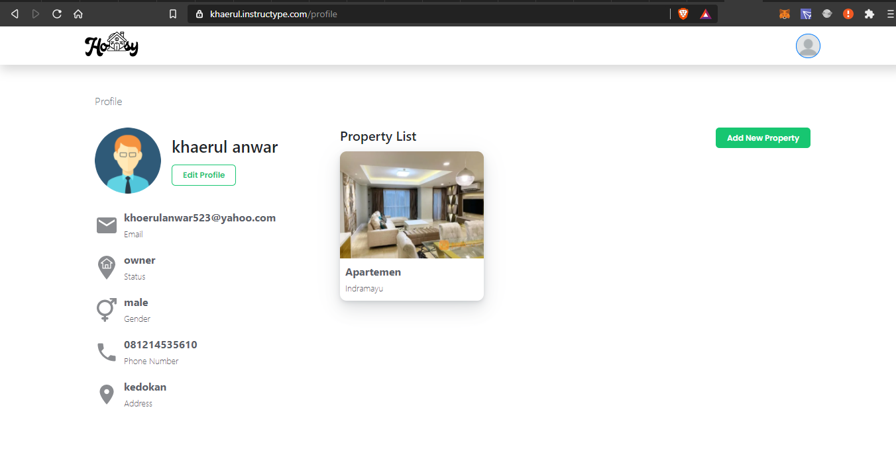

# SSL CONFIGURATION

* kemudian install SSL certificate pada sub domain ``api.khaerul.instructype.com`` dengan perintah berikut :

```
sudo certbot --nginx -d api.khaerul.instructype
choose 2
```



* kemudian cek apakah SSL sudah terinstal pada backend config, di kasus saya SSL gagal diinstal sehingga terpaksa harus mengganti domain.

```
cat backend.conf
```




* terakhir adalah rubah base URL dari API pada server frontend menggunakan alamat api yang sudah di setting



