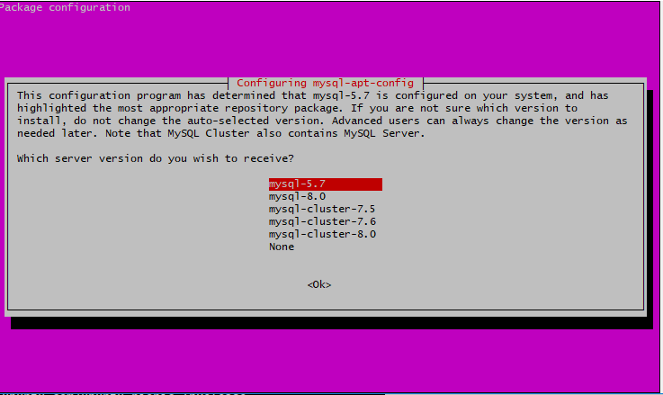
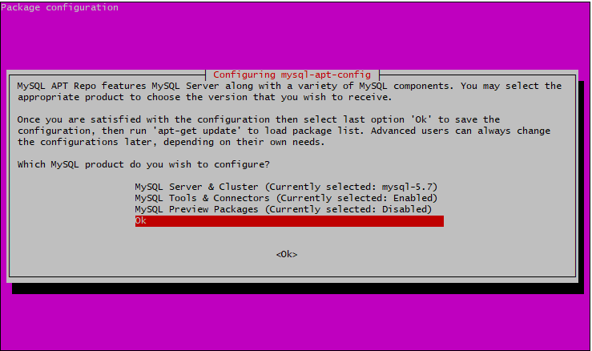
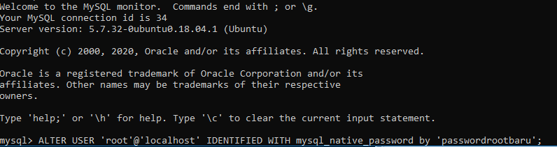
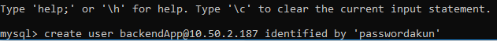
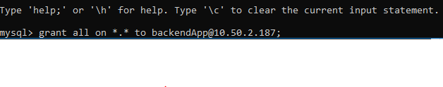
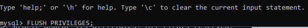
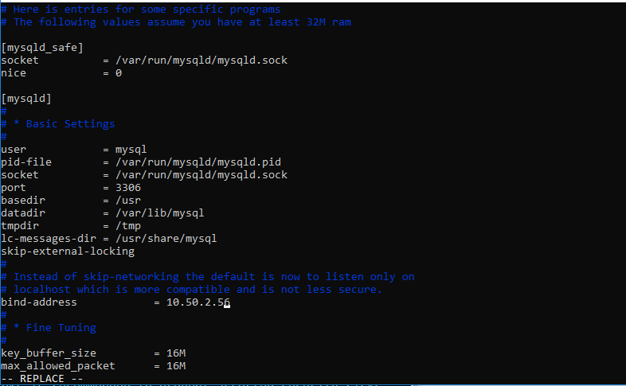

# Setup Setup Database

* masuk ke server database melalui server backend, lakukan update dan upgrade

````
sudo apt update && sudo apt upgrade
````

* Install Mysql Server Gunakan MySQL versi 5.7






* Setelah proses instalasi selesai masuk ke mysql

````
sudo mysql -u root -p
````

* pada dasarnya default mysql tidak memiliki password maka dari itu kita akan menambahakn password pada user root dengan perintah dibawah, setelah relog dengan password baru.



* disini kita akan membuat user baru untuk mengakses server database agar bis di remote malalui backend.

```
create user 'namauser'@'ip-server-backend' identified by 'password'; 

grant all on *.* to 'namauser'@'ip-server-backend';

FLUSH PRIVILEGES;
```





* Kemudian Setting bind Address dari server database menggunakan ip private server.


