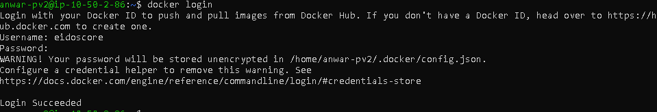
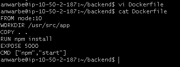
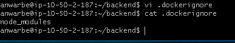
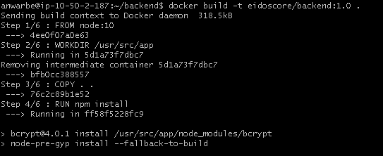
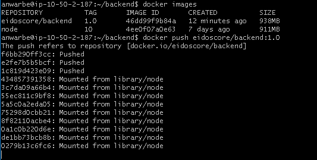

# Create Docker Image

* Login akun docker

*  masuk kedalam direktori lalu buat file Dockerfile isi dengan command berikut

``
FROM node:10
WORKDIR /usr/src/app  
COPY . .  
RUN npm install
EXPOSE 5000
CMD ["npm","start"]
``

* kemudian buat file .dockerignore

* kemudian build image yang sudah di config sebelumnya :

`` docker build -t eidoscore/backend:1.0 . ``

* cek image yang sudah dibuat

* tambahkan docker key pada server

