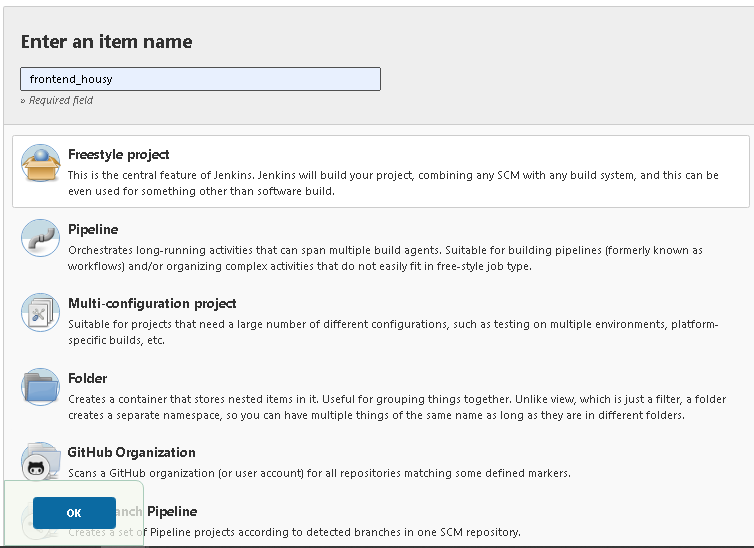
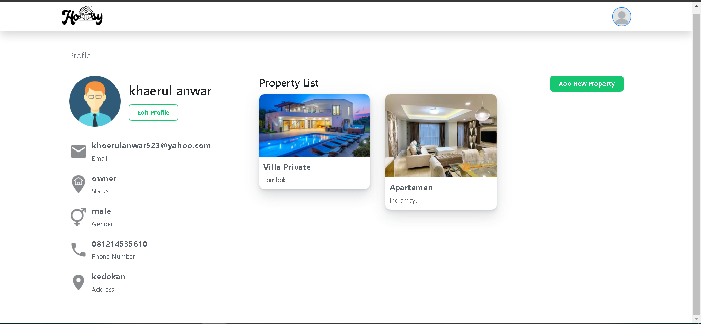

# Create Jenkins Job

* buat job baru pilih ``Freestyle Project`` dan berinama :

* pada tab Source Code Management pilih Git, dan edit konfigurasi seperti berikut setelah itu simpan:

* buat tambahkan semua server untuk membuat job pada jenkins

* masuk ke repository github kita dan setting kemudian buat webhook pada github repo private kita seperti gambar :

* kemudian test buat perubahan pada server semisal disini saya merubah file test pada repo dan push

* lihat pada job yg sudah kita buat dan kita edit repo maka akan menampilkan sukses build seperti ini ini jika berhasil.

* buat docker compose dan setting seperti berikut

* hubungkan akun docker hub dengan github agar ketika nanti selesai melakukan build maka image docker akan otomatis di push ke docker hub kita

# Notifikasi

untuk notifikasi proses build disini saya menggunakan Slack, jadi ketika nanti ada update job pada jenkins seperi berhasil build, gagal build, dan sebagainya akan diinformasikan melalui channel slack saya.

* pertama buat channel Slack baru dan kemudian pilih ``Connect an app`` cari aplikasi jenkins CI

