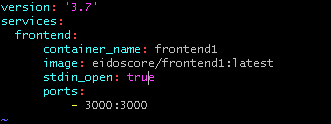
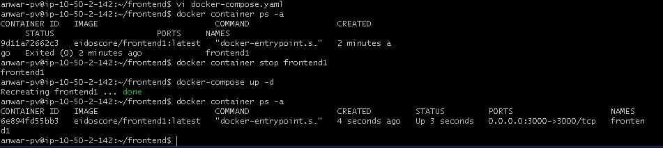

# Install Application

* Instal Docker compose pada server

``sudo curl -L "https://github.com/docker/compose/releases/download/1.27.4.docker/docker-compose-$(uname -s)-$(uname -m)" -o /usr/local/bin/docker-compose``

* buat file docker compose pada direktori dan isikan command seperti berikut:

* jalankan file docker compose dan container akan segera dibuat, lakukan pada server yang lain :

