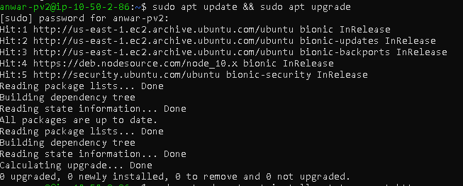
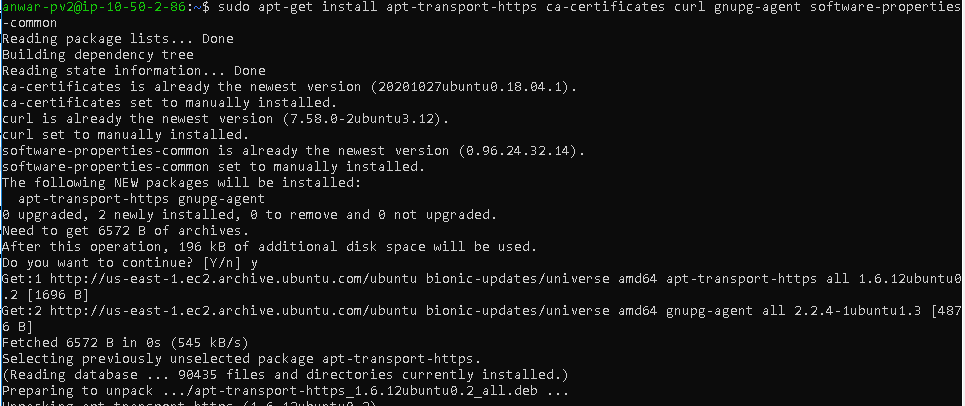
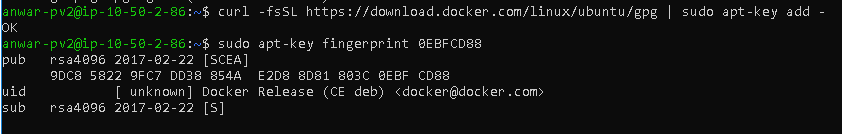
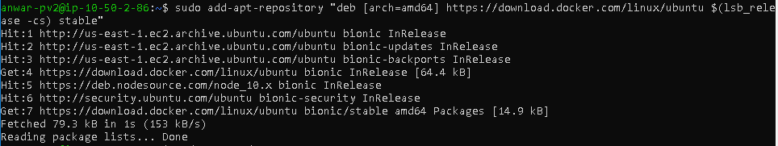
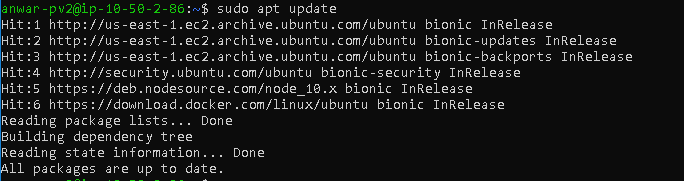
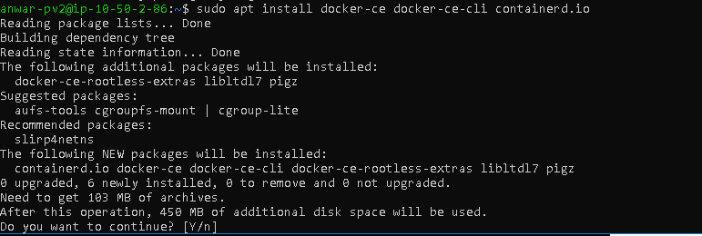
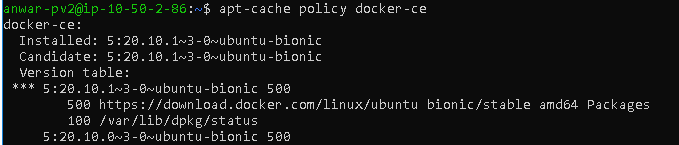
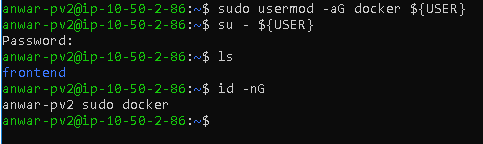

# Install Docker

* Pertama lakukan update dan upgrade package

``sudo apt update && sudo apt upgrade``

* kemudian install software common properties

``sudo apt install apt-transport-https ca-certificates curl software-properties-common
``

* tambahkan docker key pada server

``curl -fsSL https://download.docker.com/linux/ubuntu/gpg | sudo apt-key add -
``

* tambahkan Repository docker pada masing-masing server

``sudo add-apt-repository "deb [arch=amd64] https://download.docker.com/linux/ubuntu bionic stable"
 ``

* kemudian update package yang sudah ditambahkan
`` sudo apt update ``

* install package docker dengan command 

`` sudo apt install docker-ce docker-ce-cli containerd.io``

* tambahkan docker key pada server

* jika tidak ingin menggunakn sudo pada perintah tambahkan command berikut untuk menambahkan docker ke group

``sudo usermod -aG docker ${USER}``
``su - ${USER}``
``id -nG``

