# Install Jenkins

* Buat Instance private baru untuk server jenkins dan perhatikan spesifikasi yang dibutuhkan, install docker menggunakan docker image :

``docker pull jenkins``

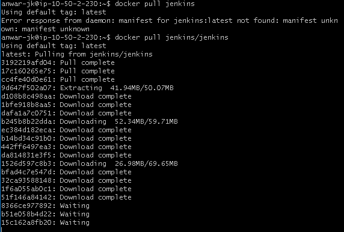

* jalankan image docker run menggunakan port expose 8080 dan juga port master slave 50000 seperti berikut serta tambahkan volume untuk menyimpan konfigurasi jenkins:

``docker run -p 8080:8080 -p 50000:50000 -d -v jenkins_home:/usr/app jenkins/jenkins ``

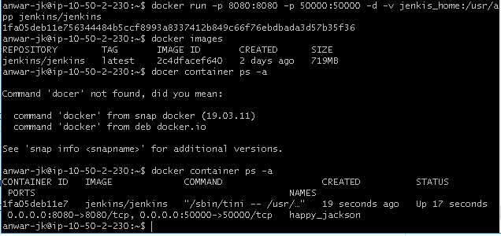

* reverse proxy server jenkins pada web server dan tambahkan sub domain :

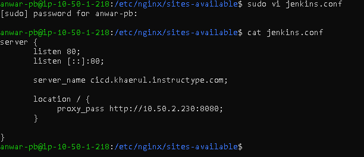

* install ssl pada subdomain :

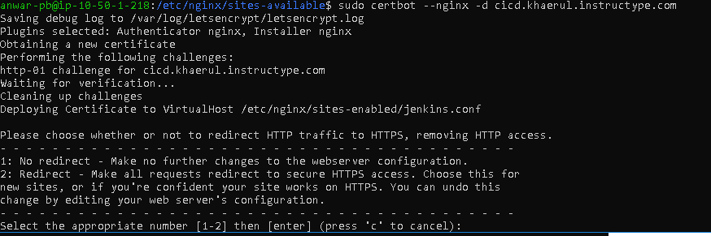

* buka direktori jenkins untuk melihat initial password aplikasi jenkins :

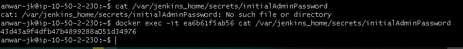

* buka jenkins pada browser dan mulai instalasi pilih ``Install Suggested Plugins`` :

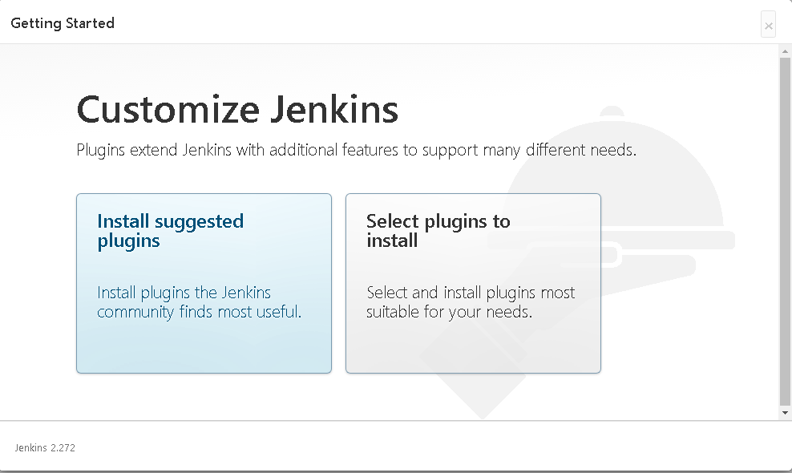
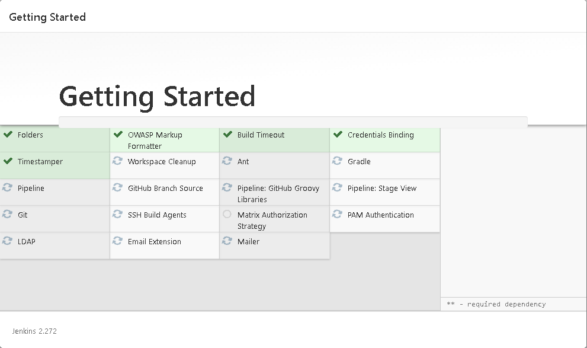

* buat penggunana admin kemudian Save and Continue :

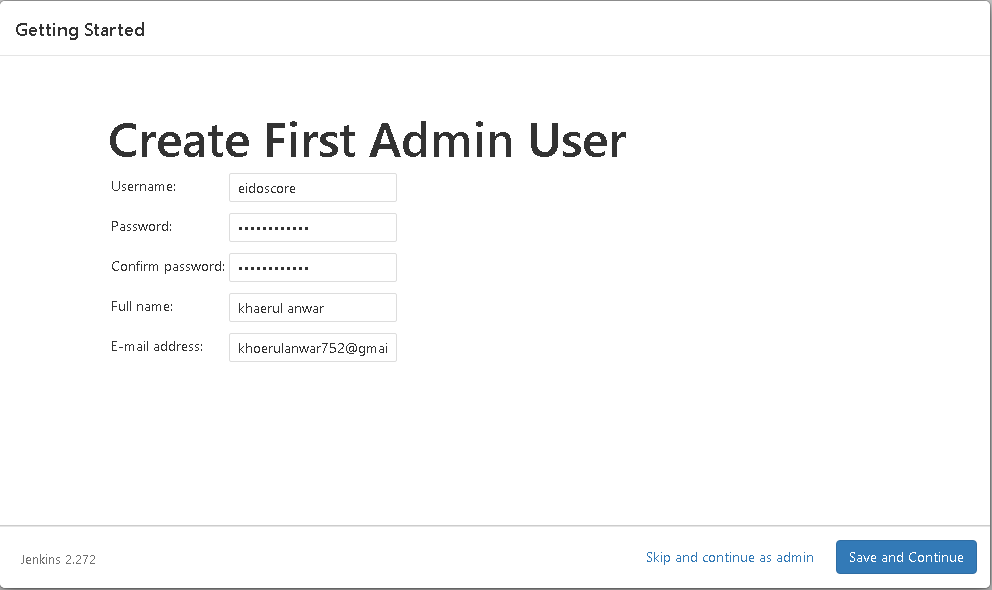

* Setting Jenkins URL bisa sudah otomatis di set :

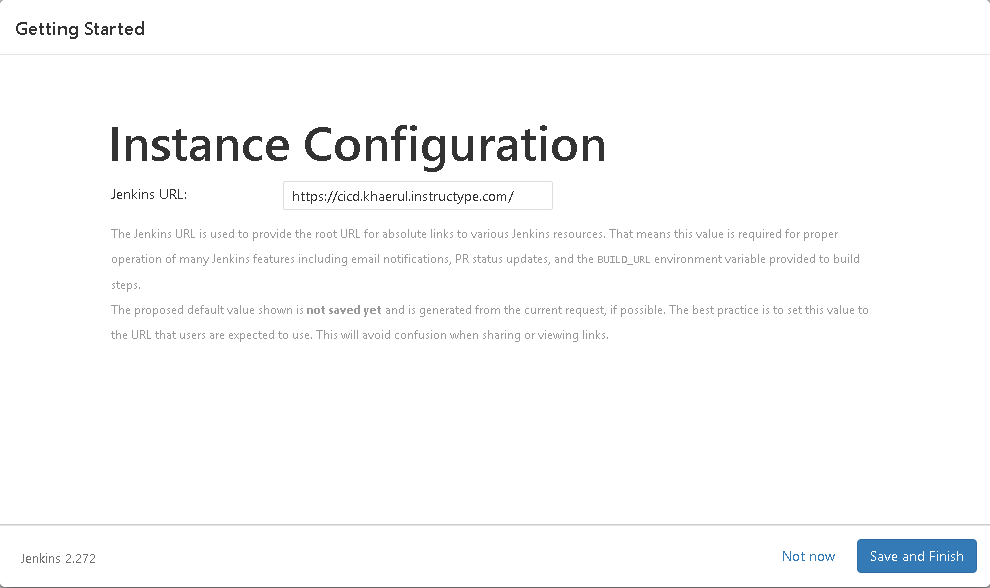
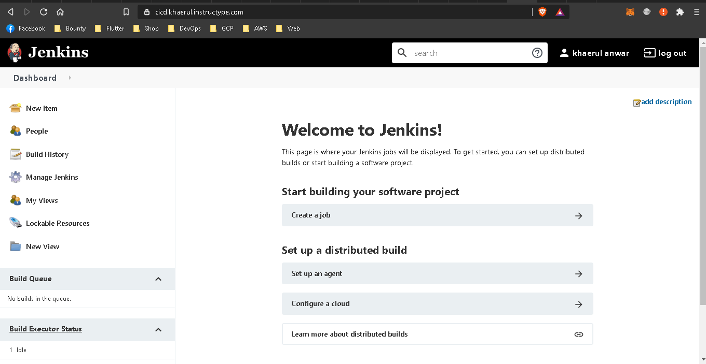

* Install Plugin ``Publish Over SSH`` :

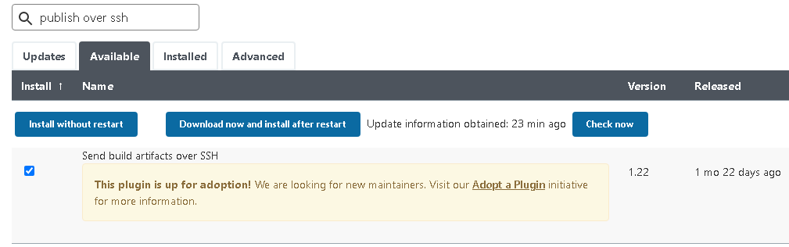

* Tambahkan credential dari masing-masing server :

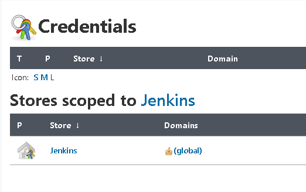
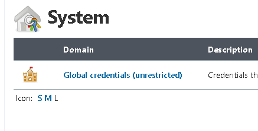
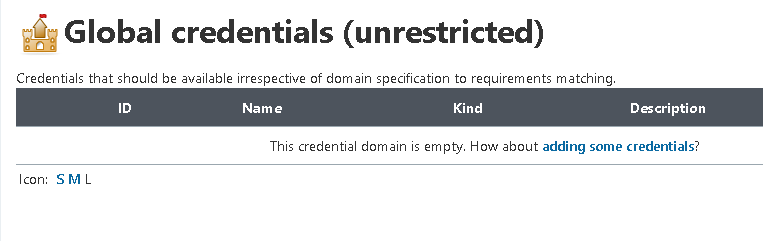
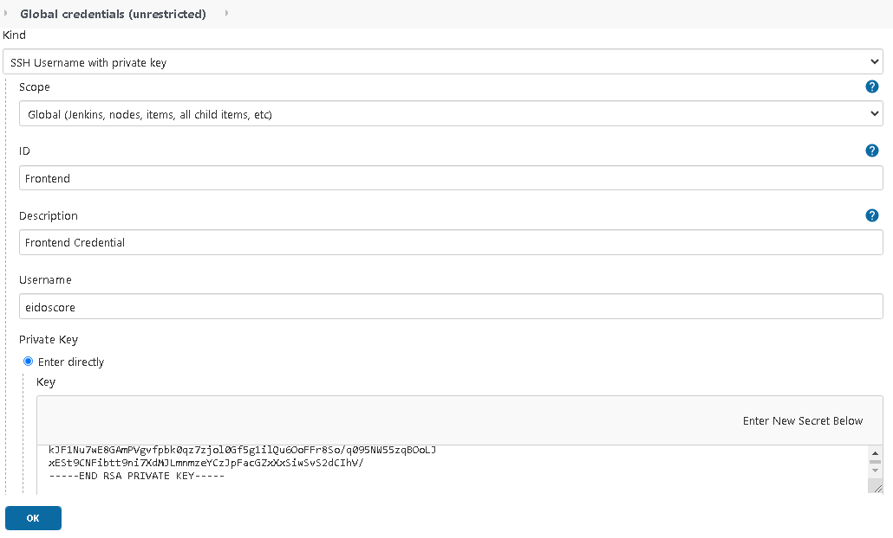

* Buat personal akses token pada akun github kita pada setting > appliation dan tambahkan token yang sudah dibuat pada jenkins :

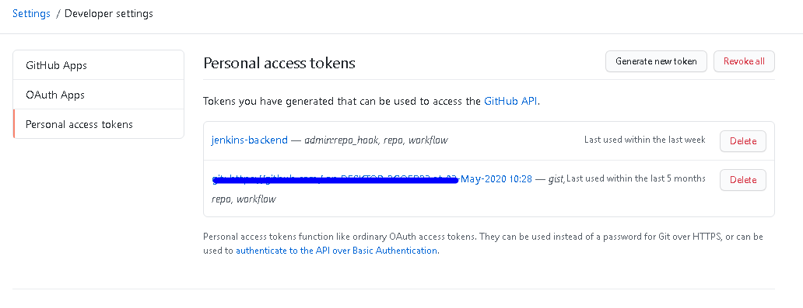
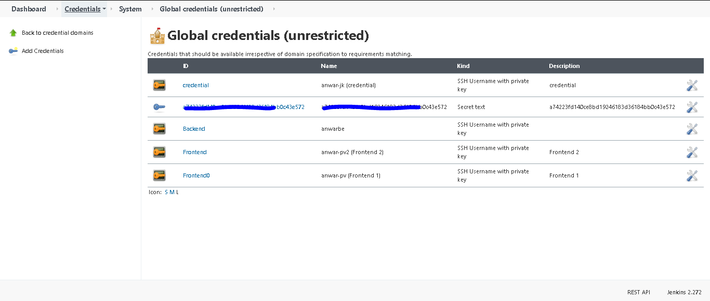

* pada Global Configuration tambahkan konfigurasi juga dari semua server agar nantinya bisa membuat job pada jenkins :

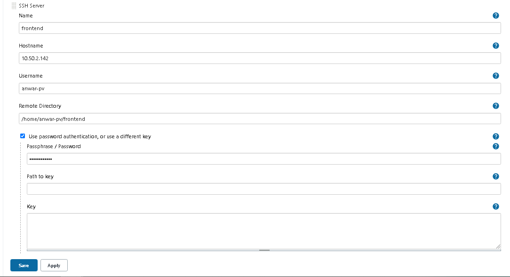

