# Connect Multiple Server to Prometheus

- Donwload Prometheus dan buat folder untuk prometheus

```
wget https://github.com/prometheus/prometheus/releases/download/v2.22.1/prometheus-2.22.1.linux-amd64.tar.gz

tar -xf prometheus-2.22.1.linux-amd64.tar.gz

sudo mv prometheus-2.22.1.linux-amd64/prometheus prometheus-2.22.1.linux-amd64/promtool /usr/local/bin

sudo mkdir /etc/prometheus /var/lib/prometheus

sudo mv prometheus-2.22.1.linux-amd64/consoles prometheus-2.22.1.linux-amd64/console_libraries /etc/prometheus
```

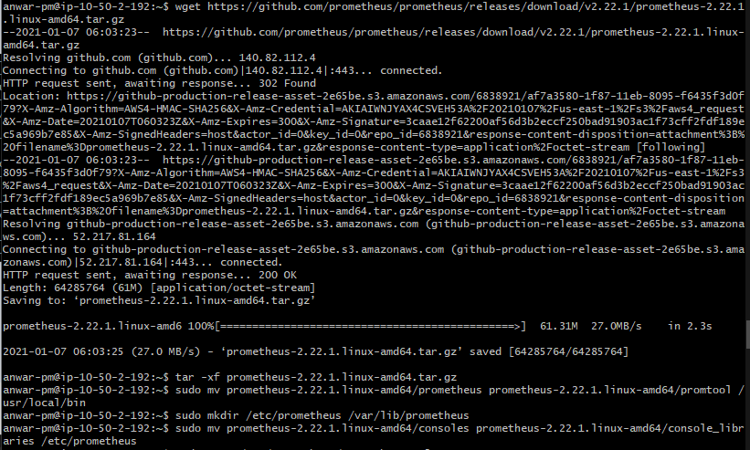

- create file configure 
```
sudo nano /etc/prometheus/prometheus.yml

global:
  scrape_interval: 5s
scrape_configs:
  - job_name: 'prometheus'
    static_configs:
      - targets: ['10.50.2.186:9090']
  - job_name: 'node_exporter'
    static_configs:
      - targets: ['3.208.152.85:9100','10.50.2.150:9100','10.50.2.126:9100','10.50.2.87:9100','10.50.2.41:9100','10.50.2.189:9100','10.50.2.186:9100']


# JANGAN LUPA GANTI IP TARGET
```  
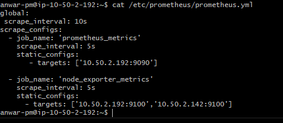

- add user and 
```
sudo useradd -rs /bin/false prometheus

sudo chown -R prometheus: /etc/prometheus /var/lib/prometheus

ls -ls /etc
```
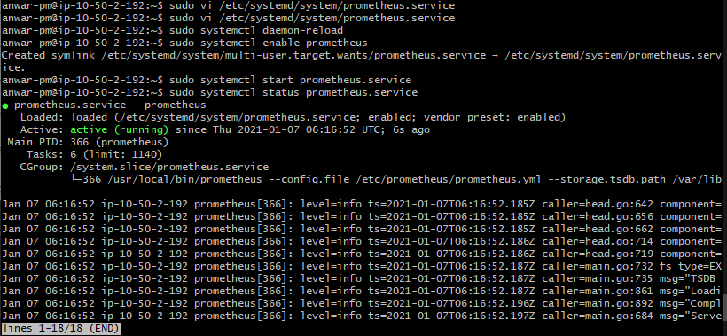

- buat konfigurasi file sudo vi /etc/systemd/system/prometheus.service


```
[Unit]
Description=Prometheus
After=network.target
[Service]
User=prometheus
Group=prometheus
Type=simple
ExecStart=/usr/local/bin/prometheus \
   --config.file /etc/prometheus/prometheus.yml \
   --storage.tsdb.path /var/lib/prometheus/ \
   --web.console.templates=/etc/prometheus/consoles \
   --web.console.libraries=/etc/prometheus/console_libraries
[Install]
WantedBy=multi-user.target
```

- run the application service
```
sudo systemctl daemon-reload

sudo systemctl enable prometheus

sudo systemctl start prometheus.service

sudo systemctl status prometheus.service

sudo netstat -ntlp
```

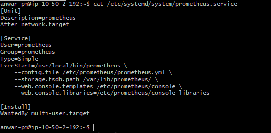
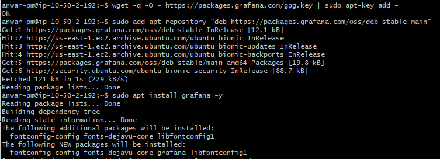
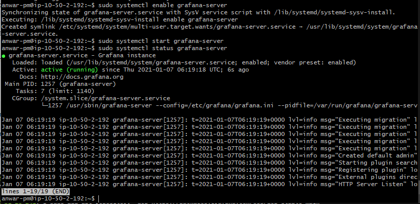

- edit buat file config untuk reverse proxy pada nginx
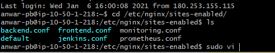
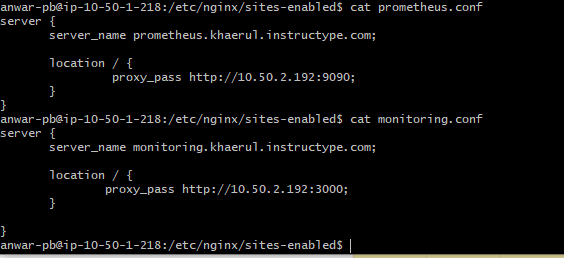

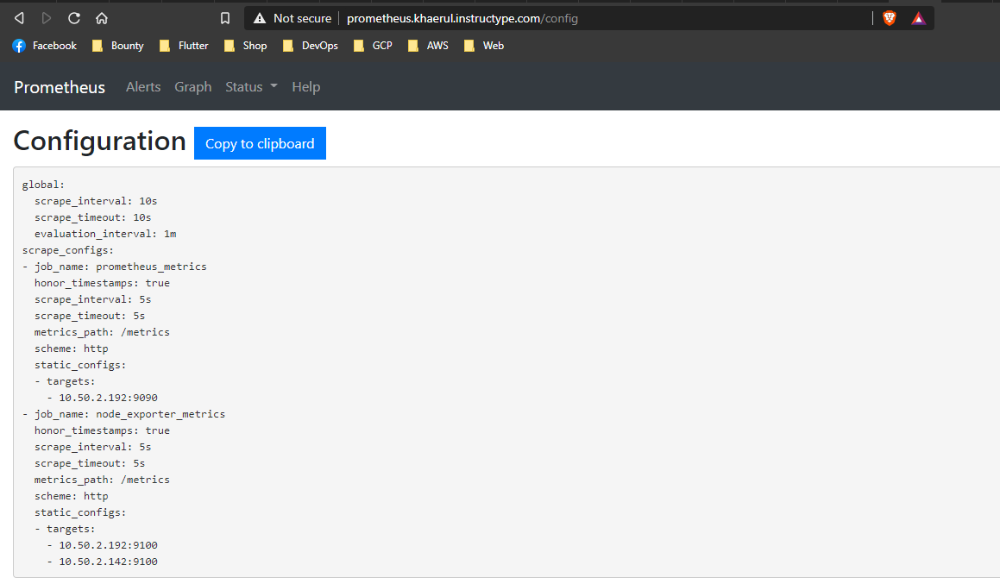
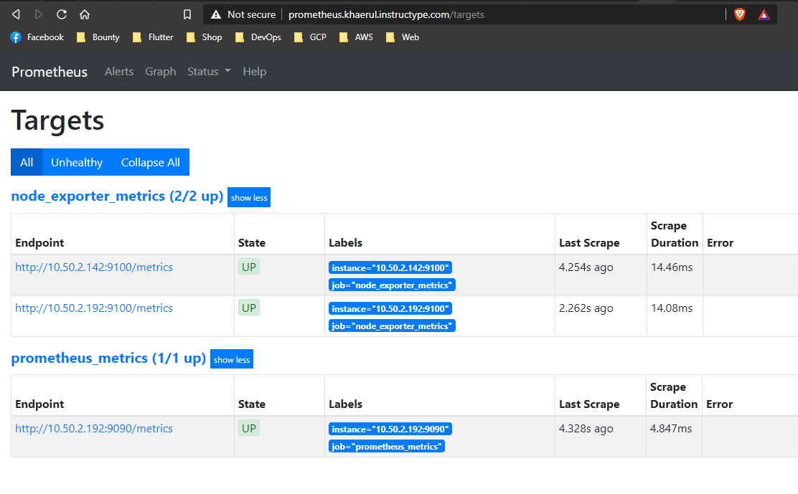

- buka web monitoring dan login dengan username/password ```admin```

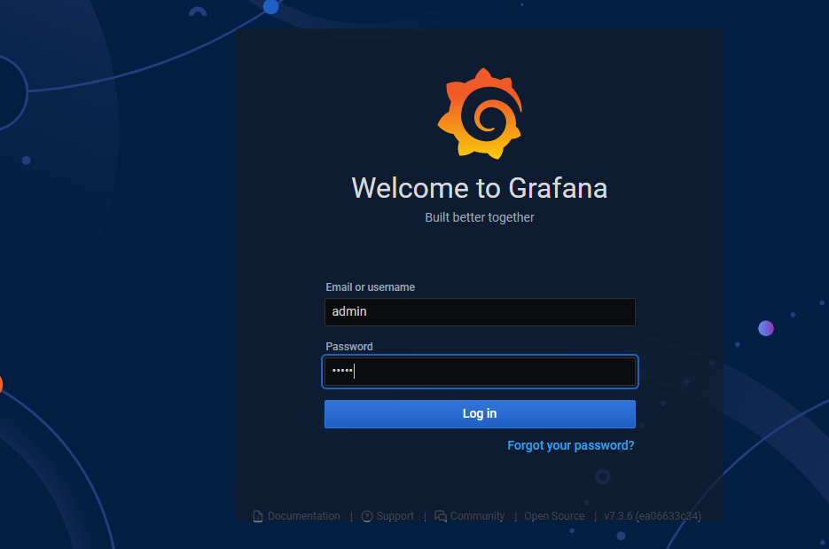

- buat username dan password baru

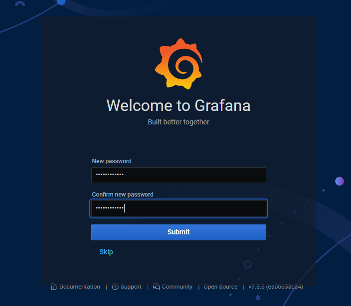

- tambahkan data source

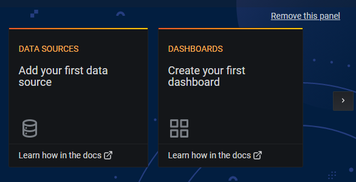

- pilih data source dari prometheus

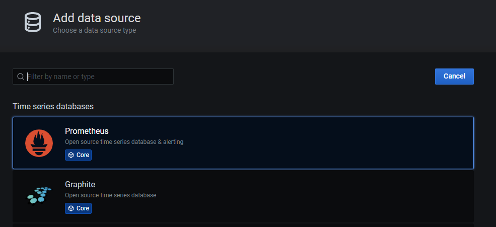

- tambahkan ssl pada subdomain

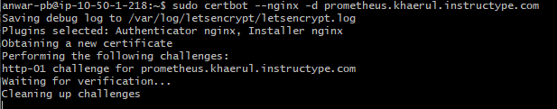

- masukan data source yaitu alamat web prometheus

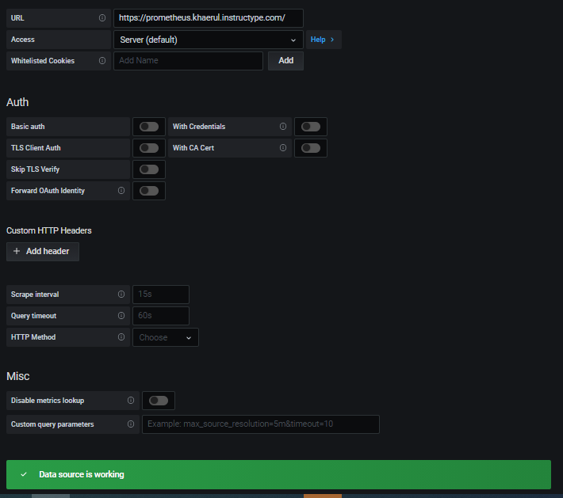

- buat panel baru untuk monitoring

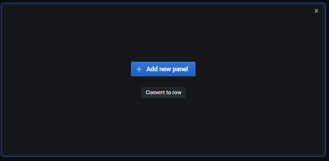

- buat panel baru untuk monitoring

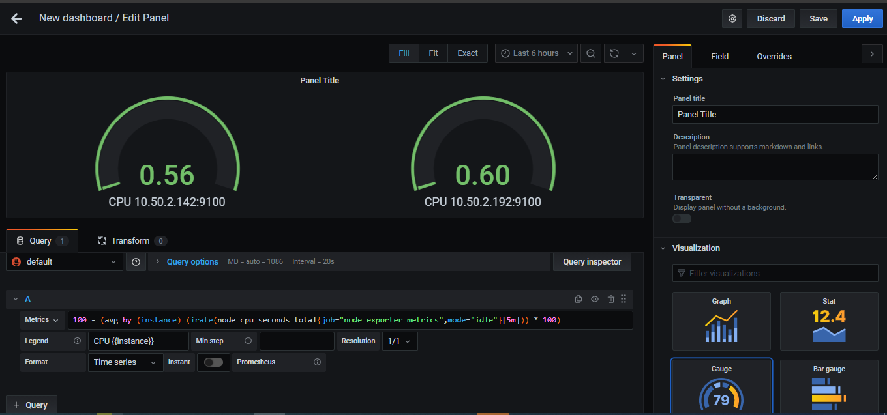
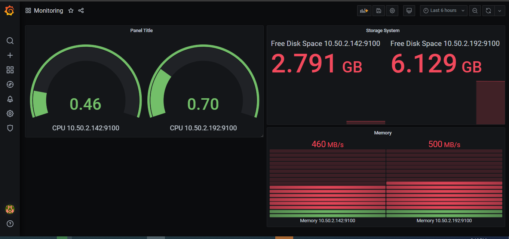