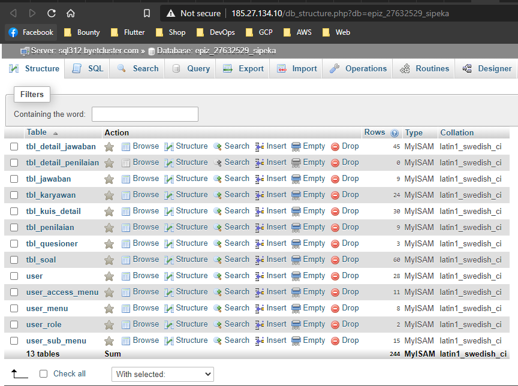
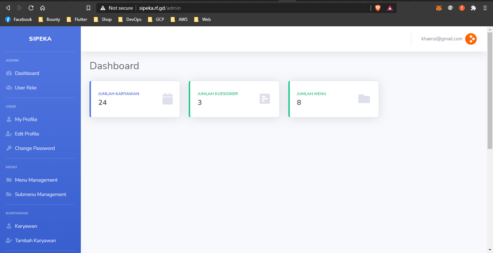
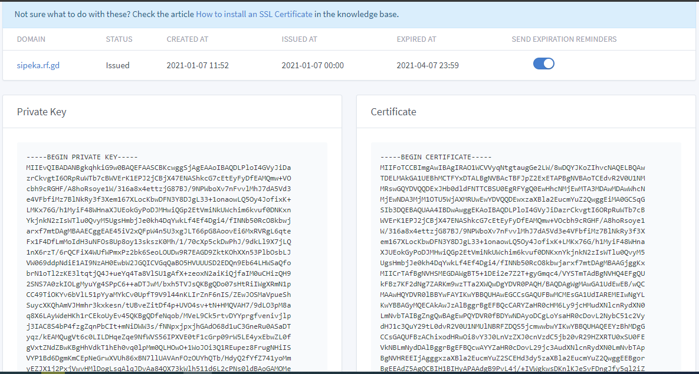

# DEploy PHP Application in Cpanel

* disini saya menggunakan layanan infinity host

- masuk ke akun/cpanel ambil username, password dan host ftp kemudian upload file web, disini saya mengupload project pribdi ke cpanel melalui ftp

- Lakukan Import database pada cpanel

- lakukan update pada file web dan sesuaikan kebutuhan, kemudian akses web

- request ssl pada website

- isi informasi diri untuk melakukan requst ssl, dan tunggu sekitr 10 menit untuk mendapatkan private key SSL

- atur CNAME record untuk pengaturan SSL

- request ssl pada website

