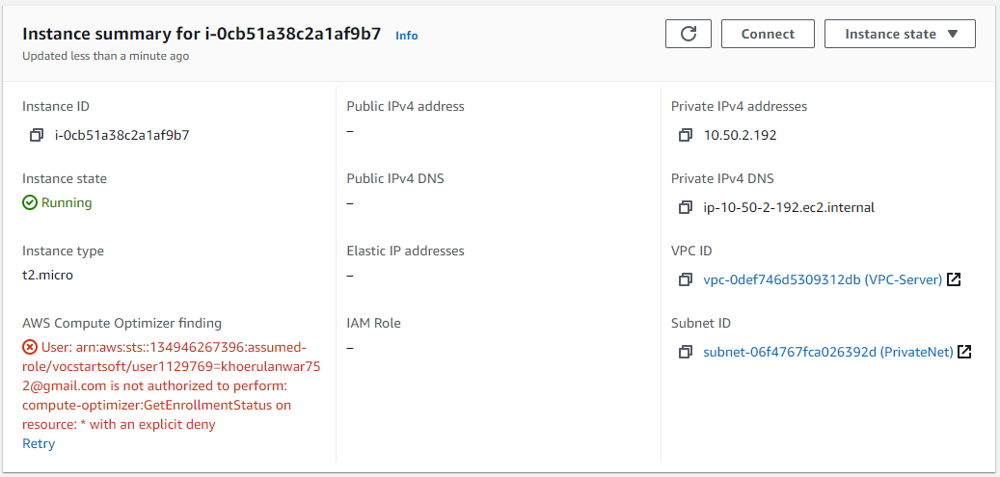

# Setup Monitoring Server

*  Buat 1 server baru untuk ansible 



* Lakukan update dan upgrade pada server


* Download dan install node_exporter
``` wget https://github.com/prometheus/node_exporter/releases/download/v1.0.1/node_exporter-1.0.1.linux-amd64.tar.gz ```


* Extract file node_Exporter

``` tar -xf node_exporter-1.0.1.linux-amd64.tar.gz ```

* pindahkan file ke folder system

``` sudo mv node_exporter-1.0.1.linux-amd64/node_exporter /usr/local/bin
 ```

* tambahkan user node_exporter

``` sudo useradd -rs /bin/false node_exporter ```

* buat file node_exporter.service ``` sudo vi /etc/systemd/system/node_exporter.service ```


```
[Unit]
Description=Node Exporter
After=network.target
[Service]
User=node_exporter
Group=node_exporter
Type=simple
ExecStart=/usr/local/bin/node_exporter
[Install]
WantedBy=multi-user.target
```


- Reload Daemon dn jalankan node_Exporter
```
sudo systemctl daemon-reload

sudo systemctl enable node_exporter

sudo systemctl start node_exporter.service
```


# Secure Promtheus using Auth Basic 


