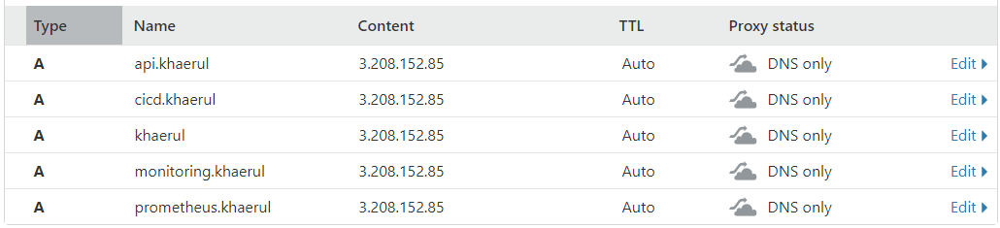

# Setup Server with Ansible

*  Buat 1 server baru untuk ansible dan berikut ada security group untuk server ansible


- buat file inventory yang berisi host dari semua server


- buat file ansible config


- buat file config, copy public key ssh kita ke semua server dengan perintah ```ssh-copy-id .ssh/id_rsa.pub username@host``` dan jalankan update untuk semua server


- buat user baru di masin-masing server


- install nginx pada server public berikut scriptnya kemudian jalankan


- install docker pada masing-masing server yang sudah di grouping docker


- kemudian install dan buat database pada server database


- lakukan reverse proxy


- Install Monitoring, pertama buat file untuk config frontend, backend dan lainnya, kemudian jalankan ansible.


# Hasil Setup Server Menggunakan Ansible





